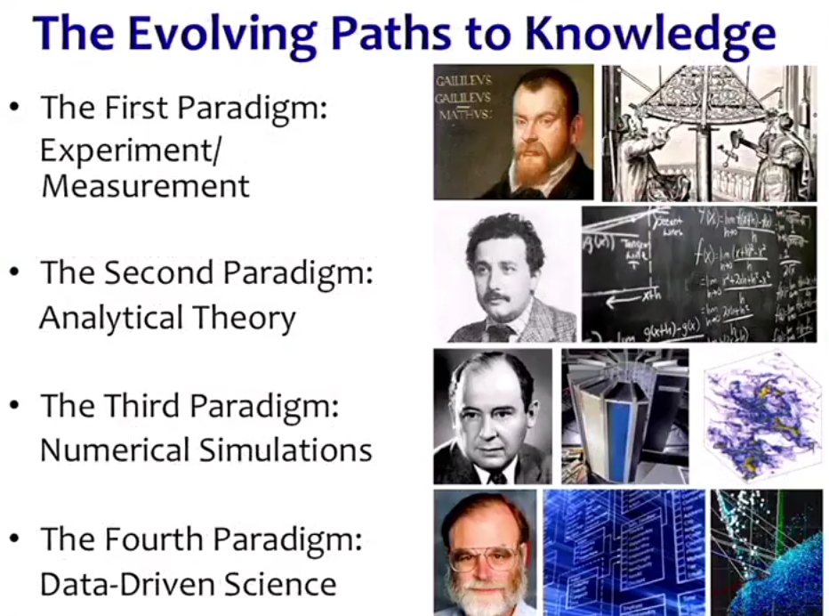

<style>
body {
text-align: justify}
</style>

```{r setup, include=FALSE}
knitr::opts_chunk$set(echo = FALSE)
```


## Contenido | Cápitulo I - Introducción 

- Introducción a los métodos numéricos 
- Representación de los números en el computador 
- Precisión de la representación 
- Errores de redondeo y truncamiento 
- Errores absolutos y relativos 

## Contenido | Cápitulo II - Solución de ecuaciones 

- Algoritmo del tanteo 
- Algoritmo de Bisección 
- Algoritmo de punto fijo 
- Algoritmo de Newton- Raphson 
- Algoritmo de la secante 
- Caso de uso 

## Contenido | Cápitulo III - Interpolación de funciones 

- Aproximación polinomica exacta 
- Método de los mínimos cuadrados 
- Polinomios en el software 
- Interpolación de lagrange
- Caso de uso 

## Contenido | Cápitulo IV - Evaluación de funciones 

- Calculo de limites 
- Derivación numérica 
- Integración numérica 
- Caso de uso 


## Referencias 

- Burden, Richard L, Análisis Númerico, Internatonal Thompson Editores, c1998.

- Carnahan, Brice. Cálculo Númerico: Métodos aplicaciones. c1979.  

## Cápitulo I 

<center>  </center>

## Cápitulo I | Introducción a los métodos númericos 

- Los métodos numéricos son técnicas mediante las cuales es posible formular problemas matemáticos de tal forma que puedan resolverse usando operaciones aritméticas.

- El análisis numérico trata de diseñar métodos para "aproximar" de una manera eficiente las soluciones de problemas expresados matemáticamente.

- El objetivo principal del análisis numérico es encontrar soluciones aproximadas a problemas complejos utilizando solo las operaciones mas simples de la aritmética. Se requiere de una secuencia de operaciones algebraicas y lógicas que producen la aproximación al problema matemático.

## Cápitulo I | Introducción a los métodos númericos 

Los métodos numéricos pueden ser aplicados para resolver procedimientos matemáticos en:

- Sistemas de ecuaciones lineales 
- Problemas de valores propios 
- Raíces en ecuaciones no lineales 
- Aproximaciones polinomiales e Interpolación 
- Ecuaciones diferenciales, integrales y calculo de derivadas 

## Cápitulo I | Introducción a los métodos númericos 

Los métodos numéricos se aplican en áreas como:
Ingeniería Industrial, Ingeniería Química, Ingeniería Civil, Ingeniería Mecánica, Ingeniería eléctrica, etc.

## Cápitulo I | Números en la computadora 

- Cuando se usa una computadora para realizar cálculos numéricos intensivos, hay dos cuestiones importantes que debemos tener en cuenta: _precisión_ y _velocidad_.

- En este apartado consideraremos detalles técnicos sobre cómo funcionan las computadoras, y sus ramificaciones para la práctica de programación, particularmente dentro de los cálculos en lenguajes de programación.

## Cápitulo I | Números en la computadora 


- La computadora típica se comunica con el usuario humano utilizando el sistema
decimal, aun cuando internamente utiliza el sistema binario, debe efectuar procesos de conversión.

- Las computadoras usan interruptores para codificar información. Un solo indicador de OFF/ON es llamado un _bit_; un grupo de ocho _bits_ se le llama **byte**. Aunque es bastante arbitrario, es habitual asociar 1 con ON y 0 con OFF.

## Cápitulo I | Números en la computadora 

El sistema binario utiliza el 2 como base, de la misma manera que el sistema decimal utiliza el 10. Por tanto,

$$427,325=4\times10^2+2\times10^1+7\times10^0+3\times10^{-1}+2\times10^{-2}+5\times10^{-3}$$
y 

$$1001,11101=1\times2^3+0\times2^2+0\times2^1+1\times2^0+1\times2^{-1}+\cdots+1\times2^{-5}$$
donde 

$$1001,11101=8+0+0+0,5+0,25+0,125+0+0,03125=9,90625$$

## Cápitulo I | Números en la computadora 

Si el contexto no aclara cual es la base numérica que se utiliza para el numero $N$, se puede utilizar la notación $(N)_{\beta}$, donde $\beta$ es la base. Así,

$$(1001,11101)_2=(9,90625)_{10}$$

## Cápitulo I | Números en la computadora 

Si $N\in Z^+$ existen $j+1$ cifras $b_0,b_1, \ldots, b_j\in\{0,1\}$ tales que $N$ tiene el desarrollo 

$$\begin{eqnarray*}
N &=& (b_j2^j+b_{j-1}2^{j-1}+\cdots+b_12^1+b_02^0)_{10}\\
  &=& (b_jb_{j-1}\cdots b_1b_0)_{2} 
\end{eqnarray*}$$
Así, 
$$\begin{eqnarray*}
(1101)_2 &=& 1\times2^3 + 1\times2^2+0\times2^1+\times2^0\\
  &=&  8+4+0+1\\
  &=&  (13)_{10}
\end{eqnarray*}$$

## Cápitulo I | Números en la computadora 

Si $0<q<1$ existe una sucesión de cifras $d_1,d_2, \ldots \in \{0,1\}$, tales que:

$$\begin{eqnarray*}
q &=& (d_12^{-1}+d_2 2^{-2}+d_3 2^{-3}+\cdots +d_k2^{-k}+\cdots)_{10}\\
  &=& (0.d_1d_2d_3\ldots d_k\ldots)_2 
\end{eqnarray*}$$

## Cápitulo I | Números en la computadora 

Por ejemplo, para $(0.7)$ tenemos que 

$$\begin{eqnarray*}
0.7 \times 2 &=& 1.4  \quad \rightarrow 1\\
0.4 \times 2 &=& 0.8  \quad \rightarrow 0\\
0.8\times 2 &=& 1.6  \quad \rightarrow 1\\
0.6\times 2 &=& 1.2  \quad \rightarrow 1\\
0.2\times 2 &=& 0.4  \quad \rightarrow 0\\
\end{eqnarray*}$$
Luego, 

$$(0,7)_{10} = (0, 10110)_2$$

## Cápitulo I | Números en la computadora 

Análogamente, 

$$(65.125)_{10}= (1000001.001)_2$$
Debido a que, 

$$ (65)_{10} = (1000001)\quad \mbox{y} \quad (0.125)_{10} = (0.001)_2$$

## Cápitulo I | Tipos de errores

- _**Exactitud**_.- Lo que está más cerca del valor verdadero. Se refiere a que tan cercano esta el valor medido o calculado con el valor verdadero.

- _**Precision**_.- Se refiere a que tan cercano esta un valor individual medido o calculado con respecto a los otros.

- _**Cifras significativas**_.- Es el conjunto de dígitos contables o necesarios que representan el valor de una magnitud independientemente de las unidades de medidas utilizadas.

## Cápitulo I | Notación científica normalizada

En el sistema decimal cualquier número real puede expresarse mediante la notación científica normalizada. Es decir, un número real $x$ distinto de cero puede representarse en la forma

$$x=\pm r\times 10^n$$

donde $r$ es un número tal que $1/10 < r <1$ y $n$ es un entero (positivo, negativo o cero).

Resulta evidente que si $x = 0$, entonces $r = 0$, en los casos restantes podemos ajustar $n$ de tal manera que $r$ se encuentre en el intervalo dado.

## Cápitulo I | Notación científica normalizada

Exactamente de la misma manera podemos utilizar la notación científica en el sistema binario. En este caso tenemos

$$x=\pm q\times 2^m$$
donde $1/2 < q <1$ y $m$ es un entero. El número $q$ se llama _**mantisa**_ y el entero $m$ _**exponente**_, el cual incluye el signo.  

## Cápitulo I | Notación científica normalizada

En una computadora binaria tanto $q$ como $m$ estarán representados como números en base 2. En el caso que nos interesa, existen $d_1,d_2, \ldots, d_k, \ldots \in \{0,1\}$, tales que, 

$$x = \pm 1.d_1,d_2, \ldots, d_k, \ldots \times2^m$$

el 1 antes del punto decimal no requiere almacenamiento. Por ejemplo,

$$(947)_{10}=(1110110011)_2= 1.110110011\times 2_2^9$$
$$(-0.7)_{10}=-0.10110_2=-1.0110\times2_2^{-1}$$
