<style>
body {
text-align: justify}
</style>

```{r setup, include=FALSE}
knitr::opts_chunk$set(echo = FALSE)
```

## Contenido | Preámbulo. 

- Fundamentos de Estadística 
- Notación 
- Herramientas tecnológicas 
- Lenguaje matemático en la Psicología 


## Contenido | Cápitulo I - Conceptos y definiciones. 

- Definición y ramas de la Estadística 
- Conceptos de población y Muestra  
- Conceptos de parámetro, estadística y estimación  
- Tipos y clasificación de variables

## Contenido | Cápitulo II - Estadística descriptiva 

- Organización de los datos en tablas de frecuencias 
- Representaciones gráficas para datos agrupados y no agrupados 
- Análisis exploratorio de datos 
- Aplicaciones en SPSS

## Contenido | Cápitulo III - Estadísticas de resumen 

- Medidas de tendencia central 
- Medidas de posición 
- Medidas de variabilidad 
- Medidas de asimetría y apuntamiento 
- Aplicaciones en SPSS

## Contenido | Cápitulo IV - Introducción a la probabilidad

- Definición de probabilidad 
- Conceptos básicos de probabilidad 
- Distribuciones de probabilidad (Binomial, poisson, normal)
- Aplicaciones en SPSS

## Contenido | Cápitulo V - Asociación de variables. 

- Distribuciones conjuntas 
- Distribuciones marginales 
- Covarianza y correlación en variables continuas 
- Correlación en variables categóricas 
- Aplicaciones en SPSS

## Referencias 

- ARON, A.y ARON, E. (2003). Estadística para Psicología. Brasil.. Prentice Hall.
- BLALOCK, H. (1987). Estadística Social. México. Fondo de Cultura Económica.
- GUILFORD, J. y otro. (1978). Estadística Aplicada a la Psicología y a la Educación. México. Mc Graw Hill.
- Martínez Bencardino, Ciro. Estadística y Muestreo. Ecoe Ediciones. Bogotá. 2003
- Estadística descriptiva y distribuciones de probabilidad. Humberto Llinas Solano. Ediciones uninorte 2006


## Números

Al considerarse los conjuntos como una colección de elementos con cierta característica que lo diferencian de los demás, los diferentes grupos numéricos: Reales, Racionales, Enteros y Naturales son catalogados como conjuntos, de tal manera que pueden representarse mediante el diagrama de Venn.

<center>
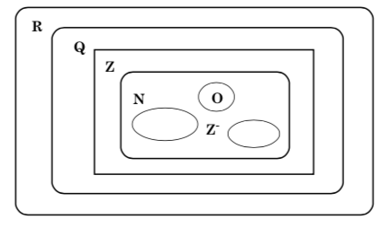
</center>

## Números

Donde:

- **N**: representa los números Naturales
- **Z**: representa los números Enteros
- **Q**: representa los números Racionales 
- **R**: representa los números Reales

## Números naturales

Matemáticamente se denota al conjunto de los números naturales con
la letra $\mathbb{N}$, tal que: 

$$\mathbb{N}=\{1,2,3, \ldots\}$$
Con estos números se pueden realizar operaciones como suma, multiplicación y potenciación.

Los números Naturales tiene como subconjuntos los números pares, impares y primos.

## Números naturales

### Numeros pares 

Se refiere a los números que son divisibles por dos $(2)$, es decir que se pueden dividir exactamente por $2$, ejemplo 2, 4,
6, 8,10,12, ...

### Numeros impares 

Son los números que son indivisibles por $(2)$, es decir que no se pueden dividir por $2$, ejemplo 1, 3, 5, 7, 9, 11, 13, 15, ...

## Números naturales

### Numeros primos 

Se dice que un número es primo si no tiene más divisores que él mismo y la unidad, ejemplo: 2, 3, 5, 7, 11, 13, 17, 19,
23, 29, 31, 37, ...... ya que:

2 únicamente se puede dividir por sí mismo 2 ÷ 2 = 1 y por la unidad
2 ÷ 1 = 2, es decir no se puede dividir por ningún otro número.

29÷ 29 = 1 y 29 ÷ 1 = 29 no hay ningún otro número que divida
exactamente a este número.

## Números enteros 

Existe otro tipo de números, los Enteros $\mathbb{Z}$. Este conjunto de números está compuesto por los enteros positivos $\mathbb{Z^+}$ (que son los mismos Naturales), por los enteros negativos $\mathbb{Z^-}$ y por el cero $(0)$. Con los números enteros se pueden realizar las mismas operaciones planteadas en los Naturales más la resta.

## Números racionales

A los números racionales se le conoce como el conjunto $\mathbb{Q}$, está conformado por el cociente de números enteros. Todos los enteros pueden ser escritos como números racionales divididos por uno $(1)$.

- Por ejemplo $\frac{9}{1}$, $\frac{-7}{1}$, ...

## Números fraccionarios 

En diversas situaciones de la vida cotidiana es necesario trabajar con trozos de cosas como por ejemplo media manzana, medio kilo de harina, entre otras, estos son los Números fraccionarios.

Ejemplo, la siguiente figura se dividió en ocho (8) partes y se tomó una Parte (la sombreada) esto equivale a decir: $\frac{1}{8}$ donde el (1) representa al numerador (o sea las partes que se toman) y el ocho (8) el denominador (las partes en que está dividida la unidad).

<center>
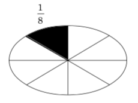
</center>

## Suma y resta de fraccionarios

Si se tiene la siguiente suma de números fraccionarios:

<center>
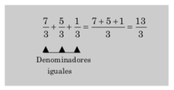
</center>

Se observa que todos los denominadores tienen el mismo número (3) o sea que las fracciones son homogéneas. Para la suma y resta de este tipo de fracciones se deja el mismo denominador (3) y se suman o restan los numeradores, de acuerdo con la operación planteada.

## Suma y resta de fraccionarios

Existe otro tipo de fraccionarios, son los que tienen los denominadores diferentes. Este tipo de fraccionarios se denominan No Homogéneos. Para llevar a cabo las operaciones de suma o resta de fraccionarios no homogéneos se debe primero hallar un denominador común para todas las fracciones y luego si realizar la operación de suma y resta de los numeradores. Veamos el siguiente ejemplo:
<center>

</center>

## Suma y resta de fraccionarios

<center>
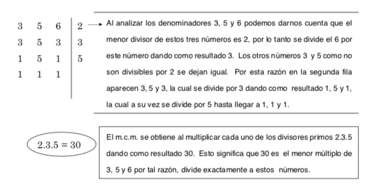
</center>

## Suma y resta de fraccionarios

El m.c.m, (30) se deja como el denominador común para todas las fracciones. Para hallar cada uno de los términos del numerador se procede de la siguiente manera: el mcm se divide por cada uno de los denominadores de las fracciones dadas (3,5,6) y se multiplican por sus respectivos numeradores.

<center>
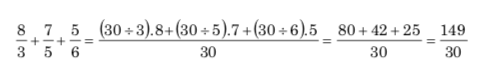
</center>

## Multiplicación de racionales

<center>
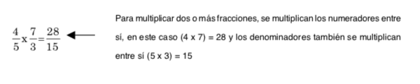 
</center>

En otros casos se puede realizar una reducción 

<center>
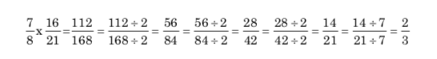 
</center>

## División de fraccionarios
<center>
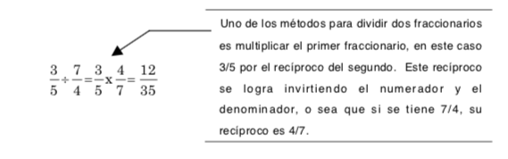 
</center>

En otros casos se puede realizar una reducción 

<center>
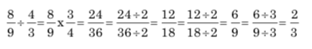 
</center>

## División de fraccionarios
<center>
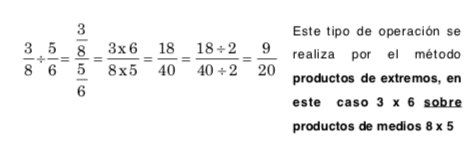 
</center>

## Números decimales

Dentro del conjunto de números racionales, se encuentra un conjunto numérico que es importante analizarlo y corresponde a los números decimales. Todos hemos escuchado la palabra decimal y globalizamos el concepto a números como 0,32, 3,25 entre otros.

Para hablar de números decimales, es pertinente recordar qué es un racional y especialmente los números fraccionarios, ya que todo número fraccionario se puede escribir como número decimal.

## Números decimales

**Fracción decimal:** se refiere a toda fracción, cuyo denominador es la unidad seguida de ceros por ejemplo:

<center>
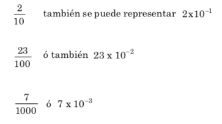 
</center>

## Números reales 

En general los números reales son todos los que hemos estudiado hasta el momento. Una de las principales características de los números reales es la de poder ser graficados en una recta. Esta es la recta real y está constituida por puntos los cuales representan un número real que puede ser racional o irracional (estos últimos, se refieren a los que tienen un número infinito de decimales, por ejemplo, el número $\pi$ que es igual 3,14159...., por este motivo no es considerado fraccionario. Los números irracionales se denotan con la letra $\mathbb{Q'}$).

## Números reales 

<center>
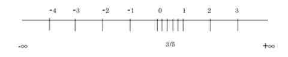 
</center>

En la gráfica, los números de la parte superior son los enteros, los de la izquierda son los enteros negativos y los de la derecha son los enteros positivos $\mathbb{Z^+}$. Es importante resaltar que también se pueden representar los números racionales $\mathbb{Q}$, por ejemplo 3/5, es decir se divide la unidad en cinco partes y se toman tres (3) partes de esta.

## Potenciación 

La potenciación es una operación que simplifica la multiplicación, ya que se puede decir que la potenciación es una multiplicación sucesiva. Esta operación es útil para abordar temas como la suma y resta de fraccionarios y simplificación, entre otras, por lo tanto es necesario tener muy claro el concepto de potenciación.

<center>
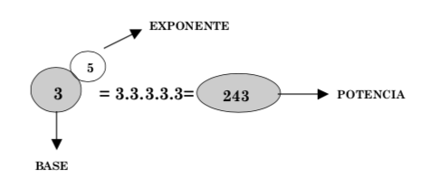 
</center>

## Potenciación

### Potencia de base positiva 

Cuando la base es positiva y el exponente positivo, la potencia es positiva. A continuación se relacionan otros ejemplos:

- $5^4=5\cdot 5\cdot 5\cdot5=625$
- $12^3=12\cdot 12\cdot 12=1728$

## Potenciación

### Potencia de base negativa 

Cuando la base es negativa, se presentan dos casos:

- Si el exponente es **PAR**, la potencia es positiva. Ejemplos:
    + $(-3)^2=3\cdot 3=9$
    + $(-4)^4=4\cdot 4 \cdot 4 \cdot 4=256$

- Si el exponente es **IMPAR**, la potencia es negativa Ejemplos:
    + $(-3)^3=(-3)\cdot (-3) \cdot (-3)=-27$
    + $(-7)^3=(-7)\cdot (-7) \cdot (-7)=-343$


## Potencia de exponente negativo

Cuando el exponente es negativo, aplicamos el recíproco para desarrollar la operación.

- $4^{-2}=\frac{1}{4^2}=\frac{1}{16}$
- $(4)^{-3}=\frac{1}{(4)^{-3}}=\frac{1}{-64}=-\frac{1}{64}$

Se debe tener cuidado con el manejo de los signos negativos, el paréntesis indica que el número está afectado por el signo. 

## Propiedades de la potenciación

- **Potencia de exponente cero:** toda base cuyo exponente es cero (0), la potencia es la unidad (1). 
$$2^0=1$$
- **Potencia de exponente uno:** toda base cuyo exponente es la unidad, tiene como potencia, la misma cantidad. _(Ley modulativa de la potencia)_.
$$32^1=32$$
- **Potencia de bases iguales:** cuando se tienen dos o más bases iguales multiplicándose entre sí, se operan, dejando la misma base y sumando los exponentes.
$$5^2+5^3+5^4=5^{(2+3+4)}=5^9=1953125$$

## Propiedades de la potenciación

- **Potencia de un producto:** cuando se tiene un producto de varios términos, elevados al mismo exponente, se expresa como producto de cada uno de los términos elevados al mismo exponente.
$$(4\cdot7 \cdot 9)^2=4^2\cdot 7^2\cdot 9^2$$
- **Potencia de un cociente:** para dividir potencias de la misma base, se restan los exponentes.
$$2^8\div 2^5= 2^{8-5}=2^3$$

## Propiedades de la potenciación

- **Potencia de una potencia:** cuando una potencia está elevada a otra potencia, la potencia tiene como base, la base de la potencia y como exponente el producto de los exponentes.
$$(2^8)^2=2^{8\cdot2}=2^{16}$$

## Radicación 

Es una operación inversa a la potenciación y consiste en hallar la **base**, conociendo el exponente y la potencia.

$$5^3=5\times5\times5=125$$
Entonces, para conocer la base se acude a la radicación
$$\sqrt[3]{125}=5$$
donde:
- 3 es el índice de la raíz (en la potenciación es el exponente)
- 125 es el radicando (este número corresponde a la potencia en el caso de potenciación)
- 5 es la raíz cúbica (3) de 125 (en la potenciación corresponde a la base)
    
## Clases de raíces:

- **Raíces de índice par:** (r= par) Las raíces de índice par tienen solución para números reales (radicando) mayores o iguales a cero. $r ≥ 0$, en este caso la solución es doble, es decir una es positiva y la otra negativa. Ejemplo:
    - $\sqrt{16}=\pm 4$, porque $(+4)^2=16$ y $(-4)^2=16$
    - $\sqrt{81}=\pm 9$, porque $(+9)^2=81$ y $(-9)^2=81$

- **Raíces de índice impar:** (r = impar) Las raíces de índice impar tienen solución para cualquier número real. $r\in $ . La solución depende de signo del radicando. Si el radicando es positivo, la solución es positiva, pero si el radicando es negativo, la solución es negativa. Lo anterior indica que la solución de raíces de índice impar es única. Ejemplos:


## Cápitulo I - Conceptos y definiciones | ¿Qué es Estadística?

La _**Estadística**_ se ocupa del manejo de la información que pueda ser cuantificada. Implica esto la descripción de conjuntos de datos y la inferencia a partir de la información recolectada de un fenómeno de interés. La función principal de la estadística abarca: Resumir, Simplificar, Comparar, Relacionar, Proyectar. Entre las tareas que debe enfrentar un estudio estadístico están:

- Delimitar con precisión la población de referencia o el conjunto de datos en estudio, las unidades que deben ser observadas, las características o variables que serán medidas u observadas.

- Estrategias de Observación: Censo, Muestreo, Diseño de Experimental

- Recolección y Registro de la información


## Cápitulo I - Conceptos y definiciones | ¿Qué es Estadística?

- Depuración de la información.

- Construcción de Tablas.

- Análisis Estadístico:

      * Producción de resúmenes gráficos y numéricos.
      * Interpretación de resultados.

## Cápitulo I - Conceptos y definiciones | Población y Muestra 

A grandes rasgos podemos decir que una _**Población**_ es el conjunto de toda posible información, o de los objetos, que permite estudiar un fenómeno de interés. 

- Una _**muestra**_ es un subconjunto de información representativa de una población.

- Las _**Variables**_ resultan ser aquellas _características de interés_ que desean ser medidas sobre los objetos o individuos seleccionados. En la mayoría de los casos lo que se pretende es estimar, a partir de la información recolectada de una muestra, características desconocidas de los objetos en dicha población de interés.

## Cápitulo I - Conceptos y definiciones | Población y Muestra 

- Las características desconocidas de una población serán llamadas _**Parámetros**_. Las características calculadas a partir de una muestra son llamadas _**Estadísticas**_. Una Inferencia es una generalización obtenida a partir de una muestra aleatoria.

- Cuando una estadística se utiliza para estimar un parámetro se dice _**Estimador**_ y las realizaciones del estimador en una muestra seleccionada se dicen _**Estimaciones**_

## Cápitulo I - Conceptos y definiciones | Ramas de la estadística 

- _**Estadística descriptiva:**_ Es el conjunto de métodos usados para la organización y presentación (descripción) de la información recolectada. La información recolectada puede ser catalogada de dos maneras: Datos Cualitativos y Cuantitativos.

- _**Estadística inferencial:**_ Comprende los métodos y procedimientos para deducir propiedades (hacer inferencias) de una población, a partir de una pequeña parte de la misma (muestra).

## Cápitulo I - Conceptos y definiciones | Tipos de variables 

- **Numéricas (Cuantitativas):** Valores numéricos 

    * _Continuas_: Número infinito de valores dentro de un rango determinado
    * _Discretas_: Conjunto especifico de valores que pueden ser contados o enumerados 
   
- **Categóricas (Cualitativas):** Un número limitado de distintas categorías
    
    * _Nominales_: Indican pertenencia o relación con una categoria definiendo un atributo 
    * _Ordinales_: Número finito de valores dentro de un rango determinado

## Cápitulo I - Conceptos y definiciones | Escalas de medición de las variables 
- Nominal 

- Ordinal 

- Intervalo 

- Razón 


## Cápitulo I - Conceptos y definiciones | Nominales 

- Se usa para asignar casos individuales a categorías

- Los estudiantes de UPB vienen de muchos Municipios diferentes

- El municipio de origen es una variable Nominal 

## Cápitulo I - Conceptos y definiciones | Ordinales 

- Utilizada para ordenar casos de nominas 

- Los municipios se pueden ordenar según el tamaño de la población 

- La clasificación por tamaño es una variable ordinal

## Cápitulo I - Conceptos y definiciones | Intervalos 

- Se usa para ordenar los casos donde la distancia o intervalo entre cada valor es igual

- Cada país tiene una longitud y latitud

- La longitud y la latitud son variables de intervalo

## Cápitulo I - Conceptos y definiciones | Razón 

- Igual que las variables de intervalo, pero tienen un "cero absoluto"

- Población (población de 0 = extinto)

- Temperatura °C (la escala de Celsius)

## Cápitulo I - Conceptos y definiciones | Resumen

De acuerdo con la posible relación que pudieran guardar los valores de una variable, se cuenta por lo menos con cuatro escalas de medición. Las variables `cualitativas` pueden ser clasificadas de acuerdo a dos escalas: `escala nominal` o `escala ordinal`. Mientras que las variables _**cuantitativas**_ pueden clasificarse por: _**escala de intervalo**_ o _**escala de razón**_.

## Cápitulo II - Distribuciones de frecuencia | Introducción 

La organización de los datos constituye la primera etapa de su tratamiento, pues, facilita los cálculos posteriores y evita posibles confusiones. La organización va a depender del número de observaciones distintas que se tengan y de las veces que se repitan cada una de ellas.

## Cápitulo II - Distribuciones de frecuuencia | Datos no agrupados 

Cuando se tiene un gran número de observaciones pero muy pocas distintas, se organizan en una tabla de frecuencias, es decir, cada uno de los valores acompañado de la frecuencia con la que se presenta. 


## Cápitulo II - Distribuciones de frecuencia 
La tabla 
$$\begin{array}
{|c|c|}
\hline
Valor & Frecuencia \\
\hline
2 & 4  \\
4 & 4  \\
5 & 3  \\
6 & 2  \\
7 & 3  \\
8 & 3  \\
9 & 1  \\
\hline
\end{array}$$

Indica que el valor 2 se repite 4 veces, el valor 4 se repite 4 veces, el valor 5 se repite 3 veces, etc ...   

## Cápitulo II - Distribuciones de frecuencia 

Para efectuar cálculos, sea cuál sea el tipo de distribución, se disponen
los datos de la siguiente forma:

$$\begin{array}
{|c|c|c|c|c|}
\hline
x_i & f_i & F_i & h_i & H_i \\
\hline
x_1 & f_1 & F_1 & h_1 & H_1\\
x_2 & f_2 & F_2 & h_2 & H_2\\
\vdots & \vdots & \vdots & \vdots & \vdots   \\
x_r & f_r & N_r = n & f_r & H_r =1\\
\hline
\end{array}$$
Donde:  

- $n$ representa al número total de observaciones (datos) en la muestra
- $x_i$: variable es la variable de interés.

## Cápitulo II - Distribuciones de frecuencia 

- $f_i$ es la frecuencia absoluta, definida como la cantidad de veces que se repite la observación (dato) en la muestra.  
- $F_i$ es la frecuencia absoluta acumulada, que se obtiene como la suma acumulada de las frecuencias absolutas, $\sum_{i=1}^r f_i$
- $h_i$ es la frecuencia relativa, definida como el cociente (división) de las frecuencias absolutas entre el tamaño de la muestra, $\frac{f_i}{n}$
- $H_i$ es la frecuencia relativa acumulada, que viene dada por la suma acumulada de las frecuencias relativas acumuladas, $\sum_{i=1}^r f_i$

## Cápitulo II - Distribuciones de frecuencia 

- _**Ejemplo 1:**_ Durante el mes de Enero, en la ciudad de Montería, se han registrado las siguientes temperaturas máximas:
32, 31, 28, 29, 33, 32, 31, 30, 31, 31, 27, 28, 29, 30, 32, 31, 31, 30, 30, 29, 29, 30, 30, 31, 30, 31, 34, 33, 33, 29, 29. Construir la tabla de frecuencias.

- _**Ejemplo 2:**_ El número de veces que han ido al cine en el último mes los alumnos de una clase es: 2, 3, 0, 1, 5, 3, 2, 1, 2, 3, 5, 0, 5, 4, 1, 1, 1, 2, 0, 1, 2. Construir la tabla de frecuencias. 

- _**Ejercicio:**_ En un grupo de estudiantes se considera el número de ensayos que necesita cada uno para memorizar una lista de seis pares de palabras. Los resultados fueron: 5, 8, 3, 9, 6, 7, 10, 6, 7, 4, 6, 9, 5, 6, 7, 9, 4, 6, 8, 7.

## Cápitulo II - Distribuciones de frecuencia 

_**Ejercicio:**_ Los psicólogos que trabajan en un Centro de Día para adultos de la tercera edad de la Ciudad de Montería, observaron el estado civil de un grupo de 120 varones que se tratan por problemas depresivos. Sus registros se presentan en la siguiente tabla:

$$\begin{array}
{|c|c|}
\hline
\mbox{Estado civil} & f_i \\
\hline
Soltero & 24  \\
Casado & 18  \\
Viudo & 42  \\
Divorciado & 36  \\
\hline
Total & 120  \\
\hline
\end{array}$$

- Complete la tabla 
- ¿Cual es el porcentaje de viudos?

## Cápitulo II - Distribuciones de frecuencia 

_**Ejercicio:**_ Según la Asociación de lucha contra la _Bulimia y la Anorexia_, las pautas culturales han determinado que la delgadez sea sinónimo de éxito social. Muchos jóvenes luchan para conseguir el “físico ideal” motivados por modelos, artistas o por la publicidad comercial.
Durante el mes de marzo del año 2016, en un colegio de la ciudad de Montería, después de las vacaciones, se observó con precaución a 27 alumnos con síntomas de anorexia, registrándose los siguientes signos visibles:

## Cápitulo II - Distribuciones de frecuencia 

$$\begin{array}
{|c|c|c|c|c|c|}
\hline
\mbox{Signo} & f_i & F_i & (\% h_i) & (\% H_i)\\
\hline
 \mbox{Dieta Severa} & 9 & 9 & 33.3 & 33.3\\
\mbox{Miedo a engordar} & 3 & - & 11.1 & -\\
\mbox{Hiperactividad} & - & 16 & 14.8 & 59.3 \\
\mbox{Uso de laxantes} & 5 & 21 & - & 77.8\\
\mbox{Uso de ropa holgada} & - & 27 & 22.2 & 100\\
\hline
Total &   \\
\hline
\end{array}$$

- Complete la tabla, ¿Que porcentaje de jóvenes se pueden considerar en riesgo por los factores de Miedo a engordar y Uso de laxantes?, ¿Cual es el factor al que se le debe prestar mayor atención?, justifique su respuesta.

## Cápitulo II - Distribuciones de frecuencia | Datos agrupados 

En el caso de que haya muchas observaciones, la mayoría de ellas distintas, pueden disponerse agrupándolas en intervalos e indicando el número de observaciones que caen dentro de cada intervalo.

## Cápitulo II - Distribuciones de frecuencia | Datos agrupados 

_**Ejemplo 1:**_  La tabla 

$$\begin{array}
{|c|c|}
\hline
Intervalo & Frecuencia \\
\hline
\lbrack 2,3 ) & 4 \\
\lbrack 3,7 ) & 6 \\
\lbrack 7,12 ) & 12 \\
\lbrack 12,21 ) & 8 \\
\lbrack 21,25 ) & 6 \\ 
\lbrack 25,30 )& 4 \\
\lbrack 30,50 ) & 3 \\
\hline
\end{array}$$

## Cápitulo II - Distribuciones de frecuencia | Datos no agrupados 

Para efectuar cálculos, en este tipo de distribución, se disponen
los datos de la siguiente forma:

$$\begin{array}
{|c|c|c|c|c|c|}
\hline
Clases & f_i & F_i & h_i & H_i & x_i \\
\hline
L_{I_{1}}-L_{S_{1}} & f_1 & F_1 & h_1 & H_1 & x_1\\
L_{I_{2}}-L_{S_{2}} & f_2 & F_2 & h_2 & H_2 & x_2\\
\vdots & \vdots & \vdots & \vdots & \vdots & \vdots   \\
L_{I_{r}}-L_{S_{r}} & f_r & N_r = n & h_r & H_r =1 & x_r\\
\hline
\end{array}$$

## Cápitulo II - Distribuciones de frecuencia | Datos no agrupados 

- $n$ representa al número total de observaciones (datos) en la muestra

- $L_{I_{i}}$ Es el límite inferior de la clase 

- $L_{S_{i}}$ Es el límite superior de la clase 

- $f_i$ es la frecuencia absoluta, definida como la cantidad de veces que se repite la observación (dato) en la muestra. 

## Cápitulo II - Distribuciones de frecuencia | Datos no agrupados 

- $F_i$ es la frecuencia absoluta acumulada, que se obtiene como la suma acumulada de las frecuencias absolutas, $\sum_{i=1}^r f_i$

- $h_i$ es la frecuencia relativa, definida como el cociente (división) de las frecuencias absolutas entre el tamaño de la muestra, $\frac{f_i}{n}$

- $H_i$ es la frecuencia relativa acumulada, que viene dada por la suma acumulada de las frecuencias relativas acumuladas, $\sum_{i=1}^r h_i$

- $x_i$: es la marca de clases y se calcula como el promedio de los límites de las clases.

## Cápitulo II - Distribuciones de frecuencia 

1. _**Calcule el Rango (R)**_ También se llama recorrido o amplitud total. Es la diferencia entre el valor mayor y el menor de los datos.

2. Seleccione el número de intervalos de _**Clase $k.$**_ Para calcular el número de intervalos se aplica la regla de Sturges:
$$ k= 1+3.32\cdot \log(n)$$

3. _**Calcule el Ancho del Intervalo**_ $(C_i).$ Se obtiene dividiendo el Rango por el número de intervalos 
 $$C_i=\frac{R}{K}$$

4. Forme los intervalos de clase al límite inferior de cada clase, comenzando por el mínimo de la distribución.

## Cápitulo II - Distribuciones de frecuencia | Datos agrupados 

_**Ejemplo 3:**_ Los siguientes datos corresponden al número de clientes que acudieron a un café Internet durante 40 días.

30, 35, 15, 21, 18, 32, 39, 20, 19, 20,
20, 34, 13, 13, 20, 35, 30, 17, 30, 31,
10, 32, 22, 14, 30, 36, 23, 14, 20, 34,
20, 28, 20, 16, 31, 38, 22, 12, 28, 13 

Para elaborar la tabla de distribución de frecuencia, seguir los siguientes pasos. 

- Paso 1. Ordenar de menor a mayor. 
10 12 13 13 13 14 14 15 16 17 18 19 20 20 20 20 20 20 20 21 22 22 23 28 28
30 30 30 30 31 31 32 32 34 34 35 35 36 38 39. 

## Cápitulo II - Distribuciones de frecuencia | Datos agrupados 

- Paso 2. Calcular el rango  
$$R=Xmáx-Xmín=39-10 = 29$$ 

- Paso 3. Calcular el número de clases 
$$k=1+3.32\log(40) = 6.318839 \cong 6$$

- Paso 4. Calcular el ancho de clase. 
$$C_i=\frac{R}{k}=\frac{29}{6}=4.8\cong 5$$

## Cápitulo II - Distribuciones de frecuencia | Datos agrupados 

- Paso 5. Formar los intervalos empezando por el mínimo como límite inferior de la primera clase y agregando (sumando) el ancho de clases $C_i$

- La tabla de frecuencias para intervalos queda de la siguiente forma según el ejemplo anterior:
$$\begin{array}
{|c|c|c|c|c|c|}
\hline
L_I-L_s & f_i & F_i & h_i & H_i & x_i \\
\hline
10-15 & f_1 & F_1 & h_1 & H_1 & x_1\\
15-20 & f_2 & F_2 & h_2 & H_2 & x_2\\
\vdots & \vdots & \vdots & \vdots & \vdots & \vdots   \\
L_{I_{6}}-L_{S_{6}} & f_6 & N_6 = n & f_6 & H_6 =1 & x_6\\
\hline
\end{array}$$

## Cápitulo II - Distribuciones de frecuencia | Datos agrupados 

_**Ejercicio 1:**_ Los siguientes datos corresponden al número de goles anotados en 40 partidos de fútbol sala en una liga local. 
3, 8, 2, 3, 8, 4, 10, 15, 4, 5, 7, 12, 6, 1, 9, 6, 4, 4, 7, 13, 8, 18, 9, 2, 11, 9, 7, 2, 14, 2, 1, 24, 10, 4, 2, 7, 6, 6, 1, 8. Se pide calcular la tabla de frecuencia por intervalos. 

_**Ejercicio 2:**_ Los siguientes datos se refieren al resultado de un examen. 6.75, 7.00, 7.00, 6.75, 6.50, 6.50, 7.15, 7.00, 6.50, 6.50, 6.50, 6.25, 6.25, 6.50, 6.65, 7.00, 7.25, 6.70, 6.00, 6.75, 6.00, 6.75, 6.75, 7.10, 7.00, 6.70, 6.50, 6.75, 6.25, 6.65, 6.75, 7.10, 7.25, 6.75, 6.25, 6.25, 7.00, 6.75, 7.00, 7.15 Se pide calcular la tabla de frecuencia por intervalos. 

## Cápitulo II - Distribuciones de frecuencia | Datos agrupados 

_**Ejercicio 3:**_ Se ha realizado una encuesta en 30 hogares en la que se les pregunta el nº de individuos que conviven en el domicilio habitualmente. Las respuestas obtenidas han sido las siguientes: 4, 4, 1, 3, 5, 3, 2, 4, 1, 6, 2, 3, 4, 5, 5, 6, 2, 3, 3, 2, 2, 1, 8, 3, 5, 3, 4, 7, 2, 3. 
- Calcule la distribución de frecuencias de la variable obteniendo las frecuencias absolutas, relativas y sus correspondientes acumuladas. 
- ¿Qué porcentaje de hogares está compuesto por tres o menos personas? 

_**Ejercicio 4:**_ El número de personas que se presentaron al examen para el permiso de conducir en 40 convocatorias fue: 
58, 66, 60, 72, 66, 70, 81, 59, 73, 68, 52, 75, 73, 68, 75, 78, 65, 68, 63, 59, 74, 80, 79, 75, 76, 66, 68, 76, 72, 70, 67 63 68 80 74 64 65 79 54 59. Se pide realizar la tabla de frecuencia por intervalos. 
